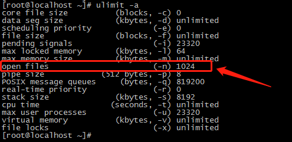

## Askcoin

Askcoin is a cryptocurrency for real-time Q&A. It was born to achieve freedom of speech and question-and-answer worldwide. It's decentralized and ASIC-resistant, this is achieved by a new POW consensus algorithm.

As we all know, bitcoin is mined by calculating sha256, so whoever calculates sha256 fast will be able to produce new blocks before anyone else, this is exactly what ASIC mining machines on the market are good at.

In order to weaken the advantages of ASIC mining machine, the mining algorithm of askcoin uses sha256 combined with memory loading to resist ASIC machine. In askcoin, the speed of mining depends mainly on the speed of memory load, not the speed of sha256 calculation.


## System requirement (recommend)

#### *Hardware requirements:*

| Resource |     Require      |
| :------: | :--------------: |
|   CPU    | 16 cores or more |
|  Memory  |   16G or more    |
|   Disk   |    1T or more    |
| Network  |   100Mb / sec    |


#### *Operating system:*

Askcoin can run on any Linux distribution *(64bit and support c++11)* such as Centos, Ubuntu, Debian, etc.

The binary release archive on GitHub is currently built on CentOS 7.4


## Configuration

The configuration file (config.json) for askcoin is as follows:

```json
{
    "log_level": "info",
    "log_path": "./log",
    "db_path": "./db",
    "network": {
        "p2p": {
            "host": "here should be your host (domain or ip address)",
            "port": 18050,
            "max_conn": 1000,
            "init_peer": [
                {
                    "host": "node1.askcoin.me",
                    "port": 18050
                },
                {
                    "host": "node2.askcoin.me",
                    "port": 18050
                },
                {
                    "host": "node1.lichuan.me",
                    "port": 18050
                }
            ]
        },
        "websocket": {
            "host": "0.0.0.0",
            "port": 19050,
            "max_conn": 5000,
            "open": true
        }
    }
}
```

- log_level:  control the level of the log and the corresponding output content, its value can be "fatal", "error", "warn", "info", "debug".
- log_path:  the directory in which the log files are stored.
- db_path:  directory for storing leveldb database files.
- network.p2p.host:  host address for P2P network communication (IP or domain name).
- network.p2p.port:  port number for P2P network communication.
- network.p2p.max_conn:  maximum number of P2P network connections allowed.
- network.p2p.init_peer:  initial peer nodes in P2P networks.
- network.websocket.host:  websocket address that mobile app and explorer can connect to. If you only want to provide internal network access, you can set this address as a LAN address (192.168.1.234, for example).
- network.websocket.port:  websocket port that mobile app and explorer can connect to.
- network.websocket.max_conn:  maximum number of websocket connections allowed.
- network.websocket.open:  whether to open websocket service.


## Max open files

On the Linux system, you can get the limit of the number of open files on the current system by typing the following commands:

```bash
ulimit -a
```

