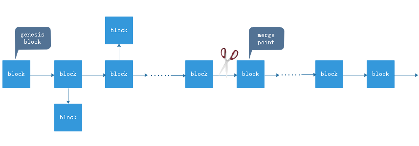

## Askcoin

Askcoin is a cryptocurrency for real-time Q&A. It was born to achieve freedom of speech and question-and-answer worldwide. It's decentralized and ASIC-resistant, this is achieved by a new POW consensus algorithm.

As we all know, bitcoin is mined by calculating sha256, so whoever calculates sha256 fast will be able to produce new blocks before anyone else, this is exactly what ASIC mining machines on the market are good at.

In order to weaken the advantages of ASIC mining machine, the mining algorithm of askcoin uses sha256 combined with memory loading to resist ASIC machine. In askcoin, the speed of mining depends mainly on the speed of memory load, not the speed of sha256 calculation.


## System requirement (recommend)

#### *Hardware requirements:*

| Resource |     Require      |
| :------: | :--------------: |
|   CPU    | 16 cores or more |
|  Memory  |   16G or more    |
|   Disk   |    1T or more    |
| Network  |   100Mb / sec    |


#### *Operating system:*

Askcoin can run on any Linux distribution *(64bit and support c++11)* such as Centos, Ubuntu, Debian, etc.

The binary release archive on GitHub is currently built on CentOS 7.4


## Configuration

The configuration file (config.json) for askcoin is as follows:

```json
{
    "log_level": "info",
    "log_path": "./log",
    "db_path": "./db",
    "network": {
        "p2p": {
            "host": "here should be your host (domain or ip address)",
            "port": 18050,
            "max_conn": 1000,
            "init_peer": [
                {
                    "host": "node1.askcoin.me",
                    "port": 18050
                },
                {
                    "host": "node2.askcoin.me",
                    "port": 18050
                },
                {
                    "host": "node1.lichuan.me",
                    "port": 18050
                }
            ]
        },
        "websocket": {
            "host": "0.0.0.0",
            "port": 19050,
            "max_conn": 5000,
            "open": true
        }
    }
}
```

- ***log_level***:  control the level of the log and the corresponding output content, its value can be "fatal", "error", "warn", "info", "debug".
- ***log_path***:  the directory in which the log files are stored.
- ***db_path***:  directory for storing leveldb database files.
- ***network.p2p.host***:  host address for P2P network communication (IP or domain name).
- ***network.p2p.port***:  port number for P2P network communication.
- ***network.p2p.max_conn***:  maximum number of P2P network connections allowed.
- ***network.p2p.init_peer***:  initial peer nodes in P2P networks.
- ***network.websocket.host***:  websocket address that mobile app or explorer can connect to. If you only want to provide internal network access, you can set this as a LAN address (192.168.1.234, for example).
- ***network.websocket.port***:  websocket port that mobile app or explorer can connect to.
- ***network.websocket.max_conn***:  maximum number of websocket connections allowed.
- ***network.websocket.open***:  whether to open websocket service.


## Max open files

On the Linux system, you can get the limit of the number of open files on the current system by typing the following command:

```bash
ulimit -a
```


If you want to provide websocket service on the full node to a large number of mobile app users, you need to increase the maximum number of open files allowed by the system. Here are two ways to do this:

- modify the ***/etc/security/limits.conf*** file (you can get how to do it by google)
- start askcoin by running the ***start.sh*** script in the release package

The following is the content of the ***start.sh*** script file:

```bash
#!/bin/bash
ulimit -HSn 50000
./askcoin
```


## Firewall ports

As described in the ***configuration*** section above, askcoin needs to open two ports in the firewall:

- P2P communication port (default 18050)
- Websocket service port (default 19050)


## Account model

Unlike Bitcoin, askcoin uses an account model, so before using askcoin, you have to register an account in the block chain. In askcoin, there are five types of transactions:

1. Register an account
2. Transfer
3. Ask a question (or topic)
4. Reply to a question
5. Reward a reply

In order to prevent DDoS attacks, 2 ASK fees will be deducted from the initiator of each transaction. But if you are registering an account, who will pay for it? That's what your referrer should do.

In askcoin, if you want to register an account, you need to enter your username, avatar, and the string signed by your referrer. When the full node receives your registration request, it will deduct 2 ASK from your referrer's account.

Of the 2 ASK fees paid for each transaction you initiate since then, 1 ASK will be paid to the miner's account that put the transaction in the block, and another 1 ASK will be paid to your referrer's account.


## Miner

If you want to be a miner, you need to do the following steps:

1. Synchronize your system time with global UTC time

2. Run the askcoin full node by executing the ***start.sh*** script

3. Run the command ***tail -f log/askcoin.log*** to check the log output generated, waiting for your full node to synchronize to the latest block

   When your full node is successfully started and synchronized to the latest block, you will see the following output on the shell terminal:

   

4. If you haven't registered an account before, you need to execute ***gen_privkey*** to generate a new private key:

   

5. Import your private key by executing ***import_privkey***:

   

6. Ask someone who has already registered an account in askcoin to generate a signature string for your registration by executing the ***gen_reg_sign*** command. When you register successfully, he or she will automatically become your referrer:

   

7. Now you can register a new account by executing the ***reg_account*** command, which requires entering your account name, your avatar ID (ranging from 1 to 100), and the signature string generated by your referrer:

   

   You need to wait patiently for the miner to put your registration request into the block. Usually it only takes about 20 seconds to get the miner's confirmation. You can confirm whether the registration is successful by executing ***get_balance***. If the output of this command shows that your balance is 0, it means that you have successfully registered. Otherwise, it means that you still need to wait for confirmation from the miner:

   

   When you register successfully, your account will automatically start mining, you can stop mining by executing the ***enable_mine*** command:

   


## Build

Askcoin is built through scons (2.5.1 compatible version). On CentOS 7.4, you can install it by running the following command:

```shell
yum install scons
```

The source code of askcoin will be open after it has passed its infancy in order to protect its originality.


## Explorer & Mobile app

- Block explorer: https://github.com/lichuan/askcoin-explorer
- Mobile app: https://github.com/lichuan/askcoin-client


## Big data on the chain

With more and more users and transactions, the data on the block chain will become larger and larger. This will bring higher and higher costs to the people who run the full node. In fact, since the beginning of askcoin's design, the problem of data expansion on the chain has been considered. Askcoin is designed to focus on decentralization and real-time Q&A, the lifetime of each topic (or question) is about one day (equivalent to 4320 block intervals). When you run askcoin for several years, the amount of data on the chain may exceed what you can accept, you can freely cut out the expired topics from the chain and choose a widely accepted block as the merging point. You can safely delete all previous blocks, just keep all account information generated until the merge point. This process is also called pruning and merging. As long as the protocol of communication between all nodes remains unchanged or compatible, there will be no adverse impact.




